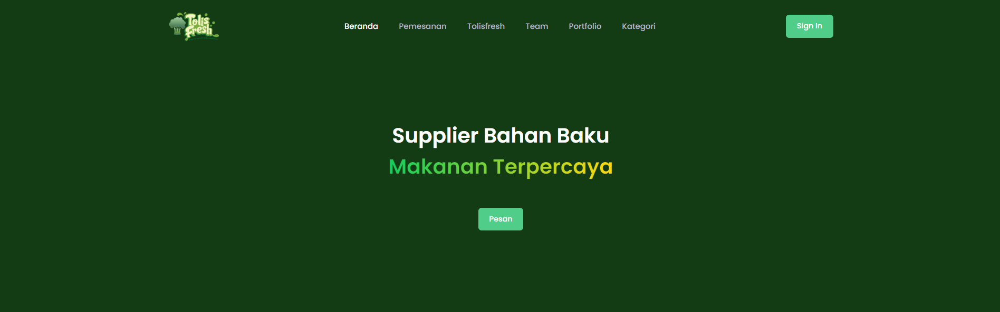

## Tolisfresh

Pada project website tolisfresh ini bertujuan untuk membuat layanan untuk menawarkan berbagai bahan baku makanan. Mulai dari anekan ayam, buah, sayur dan sembako. Saat ini pada website ini terdapat beberapa fitur yang bisa digunakan.




## Persyaratan

Pastikan sebelumnya sudah menginstall node dan npm. Selain itu diperlukan juga nodemon, postgreSQL dan sequelize.

## Instalasi

Pastikan untuk menginstall sequelize dulu secara global

```
npm install -g sequelize-cli
```

Selain itu kalian juga harus install nodemon

```
npm install -g nodemon
```

Selanjutnya install semua dependencie dengan carai seperti ini:

```
npm install
```

Buatkan table database menggunakan sequelize

```
sequelize db:migrate
```

Bila sudah membuat table, masukan data-data dummy menggunakan cara ini

```
sequelize db:seed:all
```

Terakhir untuk menjalakan project, gunakan nodemon

```
nodemon app
```
